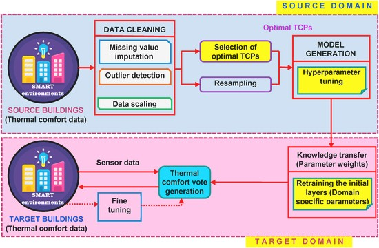

# A-hybrid-deep-transfer-learning-strategy-for-thermal-comfort-prediction-in-buildings
IndicSwipe is aimed at developing a keyboard that supports gesture typing in Indic languages on mobile devices. IndicSwipe provides a novel Deep Learning architecture that jointly uses Transformers and LSTMs to accurately decode noisy swipe inputs and has been tested on 7 languages. To further research in this field, we release two datasets that are generated by simulations that model human motor control using the principles of jerk minimization. For detailed information regarding this work, please visit our [official website](https://emilbiju.github.io/indic-swipe). 

The models and datasets have been developed to cater to two closely related tasks:

- **Indic-to-Indic Decoding:** To support users who prefer to type in the native Indic script (Devanagari, Bengali, etc.)
- **English-to-Indic Decoding:** To support users who prefer to type using an English script keyboard but want the output in the native script.

IndicSwipe demonstrates high decoding accuracies on both tasks varying from 70% to 95% across the 7 languages.

   

## Key Contributions
1. A transfer learning based CNN-LSTM (TL CNN-LSTM) model is presented for accurate thermal comfort prediction in buildings with limited modeling data across different climate zones. In the design of TL CNN-LSTM, two significant challenges such as the identification of significant TCPs and imbalanced nature of the data were addressed.
2. The developed model takes input of personal, indoor and outdoor features from the source datasets in specific order and captures the spatio temporal relations for accurate thermal comfort modeling.
3. Extensive experiments on ASHRAE RP-884, Scales project, and Medium US office datasets show that TL CNN-LSTM outperforms the state of-the-art thermal comfort algorithms in terms of various quality metrics (Accuracy, ROC-AUC Score, Mathews Correlation Coefficient)).
4. The studies on the impact of significant TCPs and their different combinations on thermal comfort modeling indicate that TL CNN-LSTM achieves best prediction performance with nine TCPs (PMV, personal, and outdoor environmental factors).
5. The experiments on analyzing the impact of (i) CNN and LSTM layers on TL CNN-LSTM, (ii) CNN-LSTM layers for parameter transfer, and (iii) size of the target dataset on TL CNN-LSTM and CNN-LSTM demonstrates the effectiveness and applicability of the proposed transductive transfer learning based thermal comfort model for buildings with limited modeling data.

## People

This work has been developed by [Anirudh Sriram](https://github.com/anirudhs123), [Dr. Nivethitha Somu ](https://scholar.google.com/citations?user=q1M0BgIAAAAJ&hl=en), [Prof. Anupama Kowli](https://www.ee.iitb.ac.in/web/people/faculty/home/anu) and [Prof.Krithi Ramamritham ](https://www.iitb.ac.in/en/employee/prof-krithi-ramamritham) from Indian Institute of Technology, Madras and Indian Institute of Technology, Bombay. Ask us your questions at [anirudhsriram30799@gmail.com](mailto:anirudhsriram30799@gmail.com).
